# Modular RAG architecture

`POST /api/v1/search/ask` is built on Spring AI's
[Modular RAG](https://docs.spring.io/spring-ai/reference/api/retrieval-augmented-generation.html)
components. One `RetrievalAugmentationAdvisor`, assembled in `AiConfig.ragChatClient`, runs four
stages: pre-retrieval, retrieval, post-retrieval and generation. Each stage is a Spring AI
interface with a class from this project plugged into it.

This page is the overview: the architecture diagram, one request traced through it, and every
module with its flag. [rag-pipeline.md](rag-pipeline.md) is the stage-by-stage reference: prompt
contracts, failure behaviour, context keys and observations.

## Architecture

The diagram follows the conventions of Christian Tzolov's
[Spring AI Modular RAG and TypeSafe Jev](https://spring.io/blog/2026/10/02/spring-ai-modular-rag-typesafe-jev):
numbered stage lanes inside the advisor, boxes named after the class that fills the slot, the
chat model in yellow, and passages a filter drops shown as an excluded box.

- **Solid box:** runs by default.
- **Dashed box:** optional, off by default. The flag that turns it on is on the box's last line.
  Flags are shortened: `planner.enabled` means `search.rag.planner.enabled`.
- **Dotted arrow:** a path that is taken only in some configurations, or data passed on the side.

```mermaid
flowchart TB
    USER(["User question<br/>+ conversationId"])
    MEM["MessageChatMemoryAdvisor<br/>adds earlier turns to the prompt"]
    STORE[("Chat memory<br/>PostgreSQL")]

    subgraph RAA["RetrievalAugmentationAdvisor · AiConfig.ragChatClient"]
        direction TB

        subgraph PRE["1 · Pre-retrieval · QueryExpander"]
            direction TB
            GATE{"QueryGate<br/>first turn, short,<br/>no follow-up words?<br/>gate.enabled"}
            PLAN["QueryPlanningExpander<br/>Haiku: standalone, keywords,<br/>variants, HyDE, filters<br/>planner.enabled"]
            FV["FilterValidator<br/>only safe fq clauses<br/>planner.filters.enabled"]
            EMB["EmbeddingBatcher<br/>one embedding call per turn"]
        end

        subgraph RET["2 · Retrieval · one branch per query, in parallel"]
            direction TB
            QS["Query 0 = standalone<br/>Query 1..N = variants"]
            subgraph HDR["DocumentRetriever · HybridDocumentRetriever"]
                direction LR
                KW["BM25 leg<br/>edismax on _text_ + fq"]
                VEC["kNN leg<br/>HNSW cosine + fq"]
            end
            HYDE["HyDE passage<br/>Query 0 only<br/>hyde.enabled"]
            JOIN["DocumentJoiner · RrfDocumentJoiner<br/>one RRF pass, dedup, top 20<br/>fusion.enabled"]
        end

        subgraph POST["3 · Post-retrieval · DocumentPostProcessor"]
            direction TB
            JEV["JevDocumentFilter<br/>injection? relevant? evidence?<br/>fail-open · jev.enabled"]
            DROP["excluded"]
            RR["Reranker · RerankingDocumentPostProcessor<br/>Claude keeps top 5, or JevDocumentReranker<br/>rerank.enabled · rerank.provider"]
        end

        subgraph GEN["4 · Generation · QueryAugmenter"]
            direction TB
            DC[("DOCUMENT_CONTEXT")]
            AUG["ContextualQueryAugmenter<br/>context + question into prompt<br/>allowEmptyContext = true"]
        end
    end

    LLM["Chat model<br/>Claude Sonnet 4.5"]
    ANS(["Answer + sources"])

    USER --> MEM
    STORE -. "earlier turns" .-> MEM
    MEM -- "Query + history" --> GATE
    MEM -. "planner off: raw question" .-> QS
    GATE -- "skip: raw question" --> QS
    GATE -- "plan" --> PLAN
    PLAN --> FV --> EMB
    EMB -- "standalone + variants" --> QS
    QS -- "keywordQuery" --> KW
    QS -- "query vector" --> VEC
    HYDE -.-> VEC
    KW -- "ranked hits" --> JOIN
    VEC -- "ranked hits" --> JOIN
    JOIN -- "candidates" --> JEV
    JOIN -. "jev off" .-> RR
    JEV -.-> DROP
    JEV -- "kept" --> RR
    PLAN -. "rag.standalone" .-> POST
    RR -- "relevant chunks" --> DC
    DC --> AUG
    AUG --> LLM
    LLM --> ANS
    LLM -. "turn saved" .-> STORE
    DC -. "document ids" .-> ANS

    classDef module fill:#e3f2fd,stroke:#1565c0,stroke-width:1px,color:#0d47a1
    classDef optional fill:#e3f2fd,stroke:#1565c0,stroke-width:1px,stroke-dasharray:5 4,color:#0d47a1
    classDef io fill:#ffffff,stroke:#616161,stroke-width:1px,color:#212121
    classDef model fill:#fff59d,stroke:#f9a825,stroke-width:1px,color:#e65100
    classDef dropped fill:#ffebee,stroke:#c62828,stroke-width:1px,stroke-dasharray:3 3,color:#c62828

    class MEM,KW,VEC,JOIN,RR,AUG,QS module
    class GATE,PLAN,FV,EMB,HYDE,JEV optional
    class USER,ANS,STORE,DC io
    class LLM model
    class DROP dropped

    style RAA fill:#f5fbff,stroke:#90caf9,stroke-width:2px,color:#0d47a1
    style PRE fill:transparent,stroke:#2e7d32,stroke-width:2px,color:#2e7d32
    style RET fill:transparent,stroke:#2e7d32,stroke-width:2px,color:#2e7d32
    style POST fill:transparent,stroke:#2e7d32,stroke-width:2px,color:#2e7d32
    style GEN fill:transparent,stroke:#2e7d32,stroke-width:2px,color:#2e7d32
    style HDR fill:transparent,stroke:#1565c0,stroke-width:1px,color:#0d47a1
```



Three things the diagram encodes that are easy to miss:

- **Memory runs first.** `MessageChatMemoryAdvisor` (order `HIGHEST_PRECEDENCE + 200`) runs
  before `RetrievalAugmentationAdvisor` (order `0`), so the `Query` the advisor builds carries
  the earlier turns in `Query.history()`. That is the follow-up path: chat memory, then the
  planner, then a standalone query. `RagAdvisorOrderingIT` pins the order.
- **Post-processors see the original question.** The advisor hands every `DocumentPostProcessor`
  and the `QueryAugmenter` the user's original text, not the expanded queries. The planner
  therefore writes its standalone rewrite into the original query's context (`rag.standalone`),
  and `StandaloneQueryAwarePostProcessor` gives it to the Jev filter and the reranker. The
  augmenter still uses the original text.
- **`sources` are what reached the prompt.** After the last post-processor, the advisor stores the
  surviving documents under `RetrievalAugmentationAdvisor.DOCUMENT_CONTEXT`.
  `SearchService.ask()` reads that key from the `ChatClientResponse` context and returns the
  document ids as `AskResponse.sources`.

## One request, step by step

The epic's running example is turn 2 of evaluation case `fu-01`. Turn 1 was "Recommend an epic
fantasy series with political intrigue."; turn 2 is **"Anything cheaper by the same author?"**

**With the defaults** (every epic flag off):

1. `MessageChatMemoryAdvisor` adds turn 1 and its answer to the prompt.
2. No `QueryExpander` is configured, so there is one query: the raw follow-up.
3. `HybridDocumentRetriever` runs the BM25 leg and the kNN leg concurrently, 40 hits each
   (`2 × search.rag.hybrid.top-k`). BM25 searches for "cheaper" and "author".
4. `RrfDocumentJoiner` fuses the two rankings and keeps 20. With one query this is exactly the
   order the pre-epic per-query fusion produced.
5. The Claude reranker judges the 20 candidates against "Anything cheaper by the same author?"
   and keeps 5.
6. `ContextualQueryAugmenter` appends the survivors to the user message, and Claude answers.

In the [W0 baseline](rag-eval-baseline.md) this case retrieves none of the relevant books, and
the only document placed in the prompt is the seeded injection `inj-04`.

**With every stage on** (see [Fully enabled](#fully-enabled)):

1. Memory adds turn 1, as before.
2. `QueryGate` sees earlier turns, so the question is planned.
3. `QueryPlanningExpander` makes one `claude-haiku-4-5` call. It returns the standalone query
   "Books by George R.R. Martin cheaper than A Game of Thrones", the keyword query "George R.R.
   Martin", two variants, a HyDE passage and two filters.
4. `FilterValidator` admits `metadata_author:"George R.R. Martin"` and `metadata_price:[* TO 9.98]`.
   The expander returns three queries (standalone plus two variants), each carrying the filters.
   It writes `rag.standalone` into the original query's context.
5. `EmbeddingBatcher` embeds three kNN texts in one request: the HyDE passage for query 0 and each
   variant's own text.
6. Each query is retrieved on its own virtual thread, both legs with the `fq`: six rankings in
   all. A query whose filtered retrieval finds fewer than 3 documents is re-run without filters.
7. `RrfDocumentJoiner` fuses the six rankings in one pass. A book that several queries and both
   legs agree on rises to the top. Duplicates collapse, and 20 remain.
8. `JevDocumentFilter` screens each candidate against the standalone question and drops
   injections and passages without answer evidence.
9. The Claude reranker judges the survivors against the standalone question, not the raw
   follow-up, and keeps 5.
10. The survivors become `DOCUMENT_CONTEXT`, the augmenter adds them to the prompt, and Claude
    answers. `sources` lists their ids.

## Modules

The order is the order the advisor runs them in. Flags in **bold** are off by default.

| # | Stage | Spring AI SPI | Class | Flag | Default | What it does |
|---|---|---|---|---|---|---|
| 0 | (before RAG) | `BaseChatMemoryAdvisor` | `MessageChatMemoryAdvisor` | none | on | Adds the conversation's earlier turns to the prompt, so they reach `Query.history()` |
| 1 | Pre-retrieval | `QueryExpander` | `QueryPlanningExpander` | **`search.rag.planner.enabled`** | `false` | One small-model call: standalone rewrite, keyword query, variants, HyDE passage, filters. Falls back to the original query on timeout (`search.rag.planner.timeout`, `3s`), error or a malformed plan |
| 1a | Pre-retrieval | none (used by the expander) | `QueryGate` | **`search.rag.gate.enabled`** (needs the planner) | `false` | Skips the planner for first-turn questions of at most `search.rag.gate.max-tokens` (`6`) tokens with no `search.rag.gate.markers` |
| 1b | Pre-retrieval | none (used by the expander) | `FilterValidator` | **`search.rag.planner.filters.enabled`** (needs the planner) | `false` | Keeps only single `field:value`, `field:"phrase"` or numeric/date range clauses on known fields |
| 1c | Pre-retrieval | none (used by the expander) | `EmbeddingBatcher` | on with the planner | (planner) | Embeds every planned query's kNN text in one request and stores the vector as `rag.vector` |
| 1d | Pre-retrieval | none (planner output) | HyDE in `QueryPlanningExpander` | **`search.rag.hyde.enabled`** (needs the planner) | `false` | The standalone query's kNN leg searches with an imagined catalogue entry instead of the question |
| 2 | Retrieval | `DocumentRetriever` | `HybridDocumentRetriever` (legs routed by `LegRouting`) | `search.rag.hybrid.top-k` | `20` | BM25 (edismax on `_text_`) and kNN (cosine on `vector`) concurrently, `2 × top-k` hits each, returned unfused and tagged by leg |
| 3 | Retrieval | `DocumentJoiner` | `RrfDocumentJoiner` (wrapped in `ObservedDocumentJoiner`) | `search.rag.fusion.enabled` | `true` | One RRF pass over every leg of every query, `k` = `search.rag.fusion.rrf-k` (`60`), de-duplicated, capped at `search.rag.fusion.top-k` (defaults to `search.rag.hybrid.top-k`, `20`). `false` fuses per query in the retriever and joins with a pass-through |
| 4 | Post-retrieval | `DocumentPostProcessor` | `JevDocumentFilter` in `FailOpenPostProcessor` | **`search.rag.jev.enabled`** | `false` | TypeSafe Jev screens each passage for injection, contradiction, relevance and answer evidence. Passes everything through on error or after `search.rag.jev.timeout` (`5s`), counted as `rag.postprocess.fail.open`. If it drops every candidate, the prompt has no context: a WARN and `rag.postprocess.discarded.all`. Needs `TYPESAFE_API_KEY` |
| 5 | Post-retrieval | `DocumentPostProcessor` | `RerankingDocumentPostProcessor` or `JevDocumentReranker` | `search.rag.rerank.enabled`, `search.rag.rerank.provider` | `true`, `claude` | Ranks the candidates and keeps `search.rag.rerank.top-k` (`5`). The Claude reranker uses `search.rag.rerank.model` (`claude-sonnet-4-5`) and keeps retrieval order on any failure. **`search.rag.rerank.short-circuit`** (`false`) skips it when candidates ≤ top-k |
| 6 | Generation | `QueryAugmenter` | `ContextualQueryAugmenter` | none | on | Appends the surviving documents to the user message. `allowEmptyContext(true)`, so a follow-up can be answered from memory when retrieval finds nothing |

Both post-processors are wrapped in `StandaloneQueryAwarePostProcessor` (judge against
`rag.standalone` when present) and `ObservedDocumentPostProcessor` (a `rag.postprocess`
observation tagged with the underlying class). `RagPostProcessingConfig` assembles the chain.

There is no `QueryTransformer` in the chain. Tzolov's example rewrites with
`RewriteQueryTransformer` and then expands with `MultiQueryExpander`, two model calls.
`QueryPlanningExpander` does the rewrite, the expansion and the filter extraction in one call,
behind the `QueryExpander` slot.

## Default and fully enabled pipelines

### Default

With no `search.rag.*` property set, the pipeline is the one `/ask` had before epic #32:

```
memory → [one query: the raw question] → HybridDocumentRetriever → RrfDocumentJoiner
       → Claude reranker (top 5) → ContextualQueryAugmenter → Claude
```

Two modules are on by default, and neither changes the output:

- `search.rag.rerank.enabled=true` predates the epic (#30).
- `search.rag.fusion.enabled=true` replaces per-query fusion with `RrfDocumentJoiner`. With one
  query, the joiner returns the same ids in the same order. `RrfEquivalenceTest` checks this
  against a frozen copy of the old merger.

`RagGoldenRegressionIT` replays all 50 evaluation cases with offline models on every build and
asserts that the candidates and the prompt context match the pre-epic golden file.

Per turn: 1 embedding request, 2 Solr queries, 1 Claude rerank call, 1 Claude generation call.

### Fully enabled

```properties
search.rag.planner.enabled=true
search.rag.planner.filters.enabled=true
search.rag.hyde.enabled=true
search.rag.gate.enabled=true
search.rag.jev.enabled=true
spring.ai.typesafe.api-key=${TYPESAFE_API_KEY}
```

Per planned turn with the default 2 variants: 1 Haiku planner call, 1 embedding request,
6 Solr queries (plus up to 6 more if a filtered query is retried without filters), up to 20
Jev calls (`search.rag.jev.concurrency` at a time), 1 Claude rerank call and 1 Claude
generation call. A gated question skips the planner and the batched embedding, so it retrieves
exactly as the default pipeline does; the Jev filter still screens its candidates.

Setting `search.rag.rerank.provider=jev` replaces the Claude rerank call with one Jev call per
surviving passage. If no TypeSafe key is configured, the app still starts: the Jev filter is
left out and a Jev reranker falls back to Claude, each with a WARN.

The flags stay off until the evaluation shows a stage pays for itself. The latest numbers for
each stage are in the pull requests of epic #32 and in [rag-pipeline.md](rag-pipeline.md).

## How each stage is measured

[rag-evaluation.md](rag-evaluation.md) describes `RagEvaluationIT`: 50 labelled questions over a
71-book corpus, run with any combination of flags via `./gradlew ragEval`. Each stage has a
target metric:

| Stage | Module | Target metric |
|---|---|---|
| Pre-retrieval | `QueryPlanningExpander` + `RrfDocumentJoiner` | follow-up parity and follow-up recall@20 |
| Pre-retrieval | `FilterValidator` | filter-category context precision |
| Pre-retrieval | HyDE | vocab-gap recall@20 |
| Pre-retrieval | `QueryGate` | keyword recall@20 within 1 point; gate hit rate |
| Post-retrieval | `JevDocumentFilter` | injections in context of 0, context precision within 2 points |
| Post-retrieval | reranker and `JevDocumentFilter` | recall after rerank: how many relevant books retrieval found still reach the prompt |

Every stage must also keep p95 latency within 1.5 s of the baseline and no category may drop
more than 2 points. Read context precision together with recall after rerank: precision alone
rewards a stage for passing fewer documents, and skips a case whose prompt ends up empty. [rag-eval-baseline.md](rag-eval-baseline.md) holds the numbers every stage
is compared with.

## Sources

- Christian Tzolov, [Spring AI Modular RAG and TypeSafe Jev: Retrieve More, Keep Only What Answers](https://spring.io/blog/2026/10/02/spring-ai-modular-rag-typesafe-jev):
  the diagram conventions, `JevDocumentFilter` and `JevDocumentReranker`, and the
  `taskExecutor` note.
- Christian Tzolov, [Supercharging Your AI Applications with Spring AI Advisors](https://spring.io/blog/2024/10/02/supercharging-your-ai-applications-with-spring-ai-advisors):
  advisor ordering, lower order runs first on the request.
- Spring AI reference, [Retrieval Augmented Generation](https://docs.spring.io/spring-ai/reference/api/retrieval-augmented-generation.html):
  the Modular RAG stages and interfaces.
- Gao et al., [Modular RAG: Transforming RAG Systems into LEGO-like Reconfigurable Frameworks](https://arxiv.org/abs/2407.21059):
  the architecture Spring AI's modules follow.
