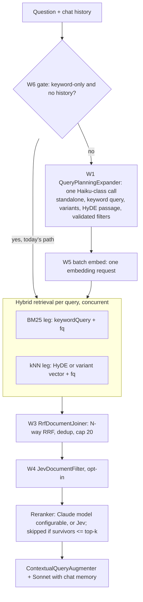

# RAG pipeline for `/api/v1/search/ask`

`/ask` answers questions with retrieval-augmented generation. It is built from Spring AI's
[modular RAG](https://docs.spring.io/spring-ai/reference/api/retrieval-augmented-generation.html)
building blocks, assembled in `AiConfig.ragChatClient` around a `RetrievalAugmentationAdvisor`.
Epic #32 adds stages to it one workstream at a time. **Every new stage ships behind a property
that defaults to off**, and is switched on only after the [evaluation harness](rag-evaluation.md)
shows it pays for itself.

This document describes each stage: what it does, why, its properties, and what happens when it
fails.

## Target pipeline (epic #32)

| Stage | Spring AI interface | Implementation | Status |
|---|---|---|---|
| Gate + planner | `QueryExpander` | `QueryPlanningExpander` | W1, W6 |
| Retrieval | `DocumentRetriever` | `HybridDocumentRetriever` | in place; per-leg inputs W2 |
| Fusion | `DocumentJoiner` | `RrfDocumentJoiner` | W3 |
| Filter | `DocumentPostProcessor` | `JevDocumentFilter` (opt-in) | W4 |
| Rerank | `DocumentPostProcessor` | `RerankingDocumentPostProcessor` | in place; configurable W4 |
| Augment | `QueryAugmenter` | `ContextualQueryAugmenter` | in place |

## How a request flows today

1. `MessageChatMemoryAdvisor` (order `HIGHEST_PRECEDENCE + 200`) splices the conversation's
   remembered messages into the prompt.
2. `RetrievalAugmentationAdvisor` (order `0`) builds a `Query`:
   - text: the user's message;
   - history: every prompt message;
   - context: a mutable copy of the request context.
3. Each query is retrieved on the task executor, the result lists are joined, the joined list goes
   through the post-processors, and the survivors are added to the user message as context.
4. Claude answers with the augmented prompt. The documents used are returned as `sources`.

The ordering in steps 1–2, and which query each component receives, are pinned by
`RetrievalAugmentationAdvisorContractTest` and `RagAdvisorOrderingIT` (W0 finding A1).

## Execution: virtual threads (W5)

`RetrievalAugmentationAdvisor` retrieves each query with `CompletableFuture.supplyAsync(..., taskExecutor)`.
Without an executor, it falls back to a private `ThreadPoolTaskExecutor` of 4–16 platform
threads. `AiConfig.ragChatClient` passes Spring Boot's `applicationTaskExecutor` instead:

- with `spring.threads.virtual.enabled=true`, each retrieval runs on its own **virtual thread**;
- with `spring.task.execution.propagate-context=true`, Boot decorates that executor with a
  `ContextPropagatingTaskDecorator`, so the current trace follows each retrieval onto its thread
  and the `rag.retrieve` spans nest under the `/ask` request.

Within one retrieval, the BM25 and kNN legs already run concurrently (`SearchRepository`).

Two side effects to be aware of:

- **No concurrency limit.** With virtual threads, `applicationTaskExecutor` is a
  `SimpleAsyncTaskExecutor` with no concurrency limit. The advisor's old pool had an unbounded
  queue, so it ran at most 4 retrievals at a time across the JVM; that implicit backpressure on
  Solr and the embedding API is gone. Today each `/ask` retrieves one query, so load still scales
  with concurrent requests only. Once the planner (W1) fans out to N queries, set
  `spring.task.execution.simple.concurrency-limit` if Solr or the embedding API needs protecting.
- **Context propagation is application-wide.** `spring.task.execution.propagate-context=true`
  decorates `applicationTaskExecutor` for every consumer (`@Async` methods included), not just
  RAG. It relies on `io.micrometer:context-propagation`, which arrives transitively through
  Micrometer Tracing and Spring AI. `TaskExecutorContextPropagationTest` pins that an
  observation opened on the caller is current on the executor's thread.

If no `applicationTaskExecutor` bean exists (for example, an application that defines its own
`Executor`), `AiConfig` logs a warning and the advisor's default pool is used, as before.

## Retrieval: hybrid search

`HybridDocumentRetriever` implements `DocumentRetriever` over
`SearchRepository.executeHybridRerankSearch()`. It runs BM25 (edismax over `_text_`) and kNN
(cosine over the 1536-dim `vector` field) concurrently and fuses them with
[Reciprocal Rank Fusion](https://plg.uwaterloo.ca/~gvcormac/cormacksigir09-rrf.pdf) (`k = 60`).
It deliberately skips `SearchService`'s Claude query-generation step: that is worth its latency
for the search API, but on a RAG turn the model already has the question.

- **Properties:** `search.rag.hybrid.top-k` (default `20`) is the number of fused *candidates*.
  It is not a context size: reranking trims it. `solr.default.collection` (default `books`).
- **Projection:** only `id,content,metadata_*`, so the 1536-float `vector` field never travels
  back with each hit.
- **Failure:** if a leg fails or both legs are empty, the repository falls back to keyword-only,
  then vector-only. If everything fails, retrieval returns no documents, and the augmenter allows
  an empty context (the answer can still come from chat memory).

### Precomputed query vectors (W5)

The kNN leg accepts a precomputed embedding. When `Query.context()` holds a `float[]` under
`rag.vector`, the retriever passes it to `SearchRepository`, which formats it for the `{!knn}`
query and **makes no embedding call**. Without it, the query text is embedded exactly as before.
This lets a later stage (W2) embed every query of a request in **one** batched request.

## Fusion: `RrfDocumentJoiner` (W3)

Pattern: [Better RAG Results with Hybrid Search](https://thetalkingapp.medium.com/spring-ai-recipe-better-rag-results-with-hybrid-search-6e6ab2d09003),
with [Reciprocal Rank Fusion](https://plg.uwaterloo.ca/~gvcormac/cormacksigir09-rrf.pdf).

**What.** The retriever returns the BM25 and kNN hits **unfused**, each tagged in metadata with
`rag.leg` (`keyword` or `vector`) and its 1-based `rag.legRank`. `RrfDocumentJoiner` then:

1. turns every leg of every query into one ranking (`Map<Query, List<List<Document>>>` →
   rankings by query and leg);
2. runs **one** N-way RRF pass over all of them, `score = Σ 1/(k + rank)`;
3. keeps one instance per document id and sets `Document.score` to the fused score. Provenance
   goes into the metadata: `rrf_score`, best `keyword_rank` / `vector_rank` across queries, and
   each leg's own `keyword_score` / `vector_score`. The per-hit `rag.leg` / `rag.legRank` are
   dropped;
4. keeps the top `search.rag.fusion.top-k`;
5. **never thresholds** the fused score. RRF scores are rank-derived and mean nothing in absolute
   terms. `minScore` applies only to the vector leg of the search API before fusion, and the RAG
   path passes none.

**Why.** Once the planner (W1) produces several queries, concatenating per-query fused lists
yields duplicates and an order that means nothing across queries. One RRF pass over every
ranking rewards consensus: a document ranked well by several legs or rewrites outranks one
ranked well by a single list.

**Deterministic ties.** Ties are broken by best single rank, then **keyword leg before vector
leg**, then document id. The keyword-first rule is what keeps the planner-off output identical
to the old per-query fusion. An exact RRF tie can only occur between documents with the same set
of ranks, and the old merger, which inserted keyword hits first, always put the one whose best
rank came from the keyword list first. Contributions are summed largest-first, so the order never
depends on the advisor's `HashMap` iteration order.

**Invariant.** With a single query (planner off), the output ids and order are identical to the
previous pipeline. This is enforced three ways:
- `RrfEquivalenceTest`: 100 seeded random keyword/vector pairs against a frozen copy of the old
  merger;
- `RrfMergerTest`: the two-list merge delegates to the N-way merge;
- `RagGoldenRegressionIT`: all 50 evaluation cases end to end.

**Fallbacks.** The legs run concurrently, each on a virtual thread with the trace carried over.
A leg that fails is logged at WARN and contributes nothing; this is how
`executeHybridRerankSearch`'s hybrid → keyword-only → vector-only cascade maps onto unfused mode:

| Situation | Old cascade | Unfused mode + joiner |
|---|---|---|
| Both legs return hits | RRF over 2·top-k per leg, cap top-k | same |
| Vector leg fails (e.g. embedding outage) | keyword-only, top-k rows | keyword hits only, capped at top-k → same documents |
| Keyword leg fails | keyword retry fails → vector-only, top-k rows | vector hits only, capped → same documents |
| Both empty or both fail | empty | empty |

**Properties.**

| Property | Default | Meaning |
|---|---|---|
| `search.rag.fusion.enabled` | `true` | `false` restores per-query fusion in the retriever plus a pass-through joiner: the W5 pipeline, as an escape hatch |
| `search.rag.fusion.top-k` | `20` | Fused candidates kept. Keep it equal to `search.rag.hybrid.top-k` for the planner-off invariant |
| `search.rag.fusion.rrf-k` | `60` | RRF smoothing constant |

The default `ConcatenationDocumentJoiner` is not used: it re-sorts documents by their own score,
and raw BM25 and cosine scores are not comparable.

## Post-processing: reranking

`RerankingDocumentPostProcessor` asks Claude to rank the candidates against the question, keeps
the best `search.rag.rerank.top-k` (default `5`), and discards the rest. Discarding is what pays
for the call: fewer, more relevant chunks compete for the model's attention.

- **Properties:** `search.rag.rerank.enabled` (default `true`), `search.rag.rerank.top-k`
  (default `5`).
- **Failure:** any error, or an unusable ranking, keeps the retrieval order truncated to `top-k`.
  It never fails the request.
- **Known gap (fixed by W1):** post-processors receive the *original* query. For a follow-up like
  "Anything cheaper by the same author?", the reranker judges relevance against a question with
  no referent.

## Augmentation

`ContextualQueryAugmenter` appends the surviving documents to the user message. It is configured
with `allowEmptyContext(true)`, because a follow-up is often answerable from chat memory alone.

## Per-query data: context keys

Stages exchange per-query data through `Query.context()` under the keys in `RagContextKeys`.
Every key is optional, and a stage that finds its key absent behaves as before.

| Key | Type | Written by | Read by |
|---|---|---|---|
| `rag.standalone` | `String` | planner (W1), into the original query | post-processors |
| `rag.keywordQuery` | `String` | planner (W1) | BM25 leg (W2) |
| `rag.vectorText` | `String` | planner, HyDE (W2) | batch embedder (W2) |
| `rag.vector` | `float[]` | batch embedder (W2) | kNN leg (W5) |
| `rag.filters` | `List<String>` | planner + `FilterValidator` (W1) | both legs (W1) |
| `rag.leg` / `rag.legRank` | `String` / `Integer` (document metadata) | retriever (W3) | RRF joiner (W3) |

Why this is safe across threads: the advisor's original-query context is a mutable map it owns.
The expander writes into it on the caller thread before retrieval is submitted, and
post-processors read it on the same thread after every retrieval has joined. Each expanded query
carries its own copy, so retrieval threads never share a map.

## Observability (W5)

Each stage records a Micrometer observation. That gives one span per stage in traces and one
timer per stage in metrics, with percentile histograms enabled by
`management.metrics.distribution.percentiles-histogram.rag=true`.

| Observation | Tags | Covers |
|---|---|---|
| `rag.retrieve` | `leg` = `keyword` / `vector` (`hybrid` with `search.rag.fusion.enabled=false`) | one retrieval leg of one query |
| `rag.join` | none | joining the per-query result lists |
| `rag.postprocess` | `processor` = post-processor class, e.g. `RerankingDocumentPostProcessor` | one post-processor |
| `rag.plan` | none | the planner's model call (W1) |

Tags are low-cardinality on purpose: never a query or a document id. In Prometheus they appear as
`rag_retrieve_seconds_bucket{leg=...}` and so on. The **Search & AI Performance** Grafana
dashboard has a **RAG Pipeline Stages** row with p50/p95 latency per stage, per leg and per
processor, plus throughput.

## Regression guard

`RagGoldenRegressionIT` replays all 50 evaluation cases with an offline hashing embedding model
and a stub chat model, and asserts that the fused candidates and the prompt context match
`src/test/resources/eval/golden-ask.json`. That file was recorded on the pipeline as it stood
before W5. With every new flag off, `/ask` must keep returning the same documents in the same
order. It needs no API keys and runs in every build.

The golden order depends on Solr's BM25 scoring and on the reranker's fallback being
deterministic. A failure after a Solr image bump, a schema or analyzer change in `solr-config`, or
a change to `HashingEmbeddingModel` is most likely a scoring change rather than a pipeline
regression. Confirm that, then re-record with `-Drag.golden.record=true` and explain the diff in
the PR.
